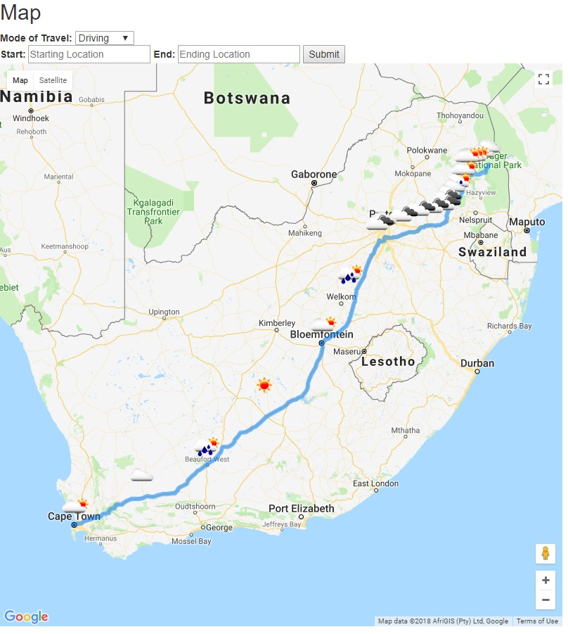

# **GeoVane**

### _THIS APPLICATION IS CURRENTLY UNDER DEVELOPMENT – PLEASE EXCUSE THE APPEARANCE_

Weclome to GeoVane! This application lets you find directions for an upcoming trip and the weather along the route in one go. GeoVane utilizes the [Google Maps Javascript API]( https://developers.google.com/maps/documentation/javascript/reference/3/) to clacluate and display routes on a Google Maps display and uses the [OpenWeatherMap API](https://openweathermap.org/api) to get the weather along your route and display the weather in easy-to-read icons on the map itself(Fig 1). You also get step by step directions for your route and a total estimated time. 

### Fig 1: Sample Map Output
